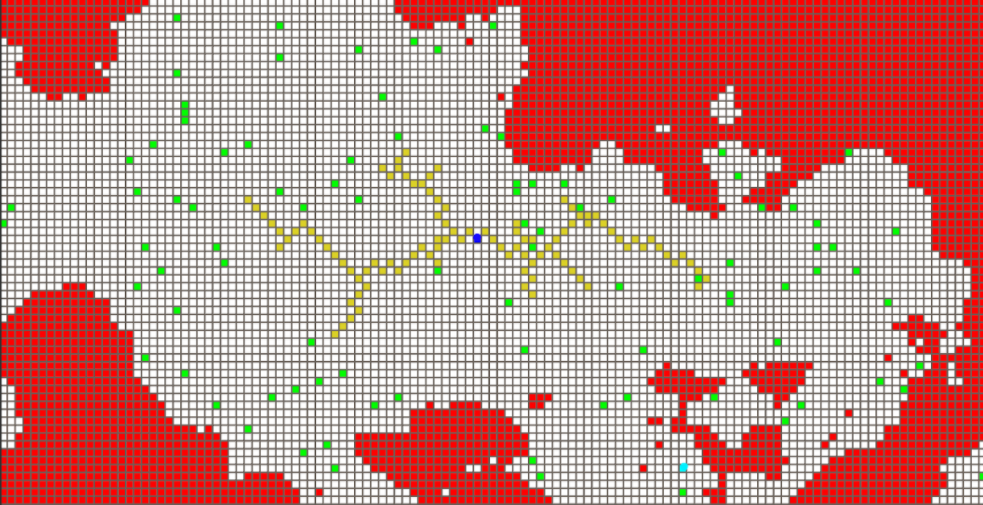

# Path Finding Algorithms Visualized
## Requirements :
To run this code you will need Unity 2019.4. 
Once that is installed, you can open ```SampleScene.unity``` to open the project.

The base version is fine, there is no need for Unity pro or higher. 

## Description :
In this project some commonly used path-finding algorithms have been visualized and simulated in Unity.

1. A-STAR


2. DIJKSTRA


3. RRT-STAR
   

## HOW TO RUN THE PROJECT (steps) :

1. Download Unity

2. Open the project in Unity. To do this, click on “open project” in File and then click on ADD as shown in the image below. 

   

3. Click on Add. and open the project folder. (Note: The project folder shouldn’t have another sub-folder of the same name. Only sub-folder that should be present are “Assets”, “Packages”, “ProjectSettings”)

   Now you can click on the project to open it. 

4. Once opened it will look like below.

   

5. Now click on the “Scenes” folder, and then double click on SampleScene (The only scene available.)

6. Once it is selected it should look like below.

   

7. After this, you can click on run to start running the project. (The play button on top)

   

8. Once click it will show.

   

9. Click on “manager” on the left toolbox (besides the map) to make the right toolbox appear.

   

10. On the right toolbox, you will see the labels “A star”, “RRT Star”, “Dijkstra”. Right-click on them and then click “Run A star ” or “Run RRT Star” or “Run Dijkstra”. Like below

    

    

11. To change the target and source. Click scene on top of the map.

    

12. Once you click it. It might look out of focus. For this, you can use the arrow keys. The top and bottom arrow keys are zoom in and zoom out. Left and right arrow keys move the screen to left or right. Also, you can use a left-click on the mouse to change the camera angle to what you prefer

    Before-

    

    After-

    

13. Now you can click on the two dots to change their position. “CYAN” is the target. “Blue is the source”. The easiest way to select them is through the left toolbox. 

    

14. Once selected it will show three arrows for the dots. You can move left and right using “Blue arrow”, up and bottom using “orange arrow”.

15. NOTE: IGNORE THE GREEN ARROW. THAT IS FOR THE DEPTH IN 3-D. THE MAP IS 2-D, SO ALL IT DOES IS TAKE THE DOT OUT OF MAP. 

16. Once done click back on the game section and left-click on labels and select to run them. (basically follow step 10 again) 

    
